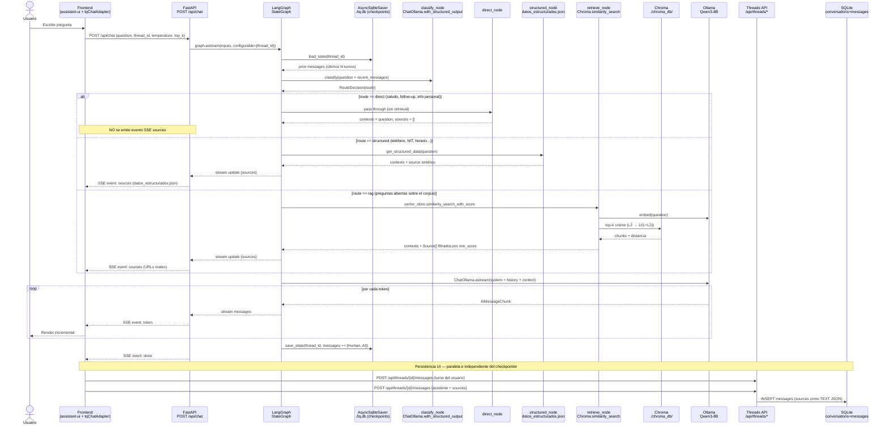
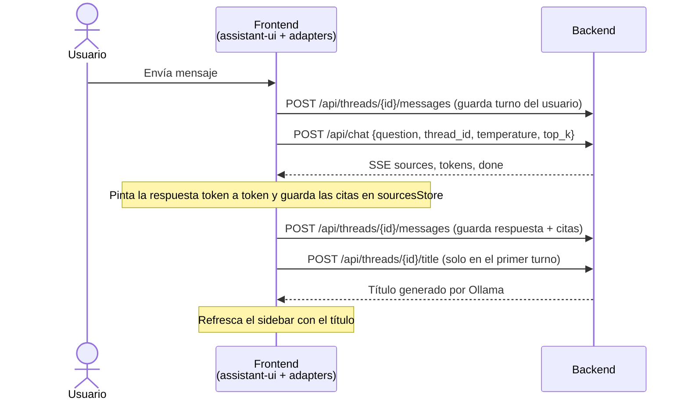
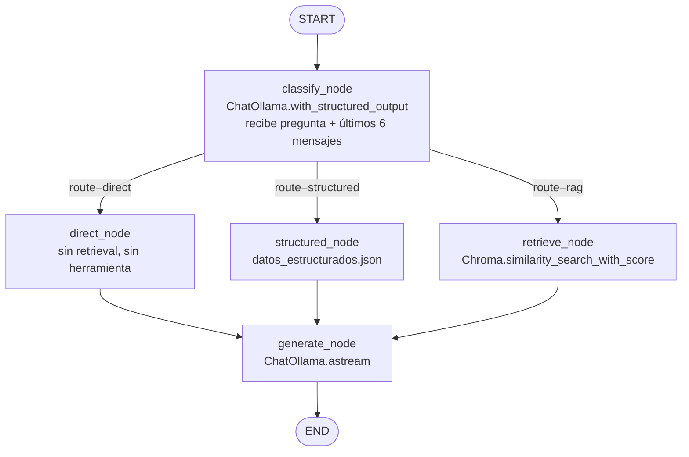
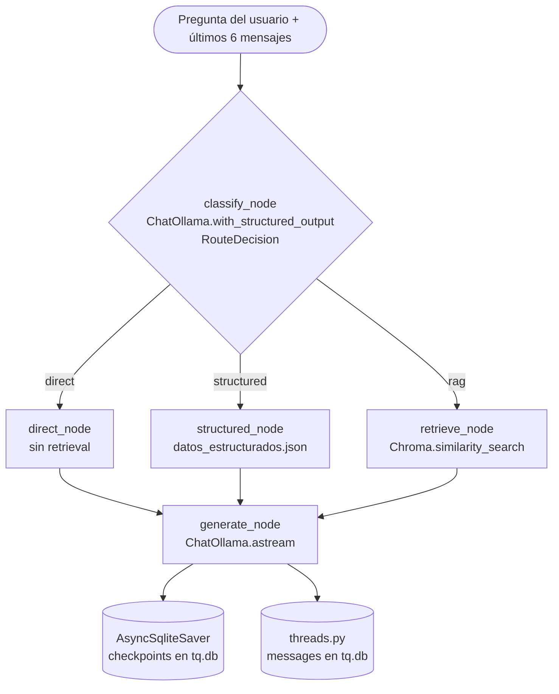

# TQ-Chatbot

Chatbot RAG sobre Tecnoquímicas S.A. — backend en FastAPI con orquestación LangGraph, LLM local Qwen3-8B vía Ollama, vector store Chroma persistente y persistencia de hilos + memoria del grafo en un único archivo SQLite. Frontend Next.js 15 + assistant-ui en un puerto separado. **Sin Docker**: todo corre como procesos del host.

> **Estado:** Reescritura completa desde cero (mayo 2026). El proyecto anterior (Streamlit + inyección de KB en prompt) fue reemplazado. Evolución dentro de esta reescritura: pgvector → Chroma → SQLite + LangGraph + LangSmith.

## Objetivos

1. **RAG real**: vector search sobre chunks embebidos en Chroma local, citando fuentes en cada respuesta.
2. **100 % local**: LLM, embeddings y vector store corren en la máquina del desarrollador (M1 Pro 16 GB target).
3. **Setup mínimo**: dos procesos (backend + frontend) más Ollama nativo. Cero contenedores, cero servidor de base de datos.
4. **Pipeline manual e idempotente**: dos scripts (`fetch_sitemaps.py`, `ingest_to_rag.py`) se ejecutan a mano, pueden re-correrse sin efectos secundarios (IDs deterministas vía `uuid5(NAMESPACE_URL, "<url>#<idx>")`).
5. **Agente con router LLM**: el sistema decide en cada turno entre 3 rutas (`direct` / `structured` / `rag`) usando `ChatOllama.with_structured_output(RouteDecision)`.
6. **Memoria por hilo via checkpointer**: `AsyncSqliteSaver` mantiene el state del grafo entre turnos, keyed por `thread_id`. Cada turno carga automáticamente el historial.
7. **Monitoreo off-the-shelf**: LangSmith trazea cada nodo del grafo cuando se activan los env vars `LANGSMITH_*`, sin instrumentación manual.

## Stack

| Capa | Tecnología |
|---|---|
| Runtime | Python 3.12, `uv` |
| API | FastAPI + Pydantic v2 |
| Orquestación | LangGraph `StateGraph` con 5 nodos (`apps/api/graph/`) |
| Router | `classify_node` con `ChatOllama.with_structured_output(RouteDecision)` (3 rutas) |
| LLM | Qwen3-8B-Instruct vía Ollama (`langchain-ollama` para el grafo, `apps/api/llm/ollama_client.py` para títulos) |
| Embeddings | Qwen3-Embedding-0.6B vía `langchain-community.OllamaEmbeddings` |
| Vector DB | Chroma persistente en `./chroma_db/` |
| Persistencia | SQLite en `./tq.db` — `conversations`+`messages` (UI) y `checkpoints`+`writes` (memoria del grafo) en el mismo archivo |
| Memoria por hilo | `AsyncSqliteSaver` — checkpoints keyed por `thread_id` |
| Monitoreo | LangSmith (opcional, vía env vars `LANGSMITH_*`) |
| Frontend | Next.js 15 (App Router) + React 19 + [assistant-ui](https://www.assistant-ui.com/) + Tailwind 3 |
| Streaming | SSE (Server-Sent Events) — parser custom dentro del `ChatModelAdapter` |
| Herramienta estructurada | `apps/api/datos_estructurados.json` + `apps/api/tools/structured_tool.py` |
| Panel de parámetros | Sliders de `temperature` y `top_k` por turno (`SettingsPanel.tsx`) |
| Scraping | [webclaw](https://github.com/0xMassi/webclaw) (Rust CLI) — `brew install` |
| Chunking | LangChain `RecursiveCharacterTextSplitter` |
| Infra | Procesos del host (sin Docker) |

Detalles y razones en [`docs/ARCHITECTURE.md`](docs/ARCHITECTURE.md).

## Cómo funciona el sistema

Diagrama de secuencia de un turno de conversación. El endpoint `/api/chat` es un traductor delgado entre LangGraph y SSE; toda la lógica vive en el grafo. La memoria la lleva `AsyncSqliteSaver` automáticamente, no hay carga manual de historial.



> **Dos capas de persistencia en `tq.db`** con responsabilidades distintas:
> - `conversations` + `messages` → vista persistente para la UI (el frontend hidrata la conversación al recargar).
> - `checkpoints` + `writes` → estado interno del grafo que el siguiente turno carga vía `AsyncSqliteSaver`.

## Flujo del frontend

El frontend usa [assistant-ui](https://www.assistant-ui.com/) como conjunto de primitivos de chat y le enchufa cuatro piezas propias:

| Pieza | Tipo assistant-ui | Responsabilidad |
|---|---|---|
| `lib/tqChatAdapter.ts` | `ChatModelAdapter` | Llama a `/api/chat`, parsea el SSE y emite el contenido acumulado del modelo. Lee `temperature`/`top_k` del `settingsStore` y `thread_id` del `threadListAdapter`. |
| `lib/threadHistoryAdapter.ts` | `ThreadHistoryAdapter` | Persiste (`append`) e hidrata (`load`) los mensajes de un hilo vía `/api/threads/*`. Re-hidrata el `sourcesStore` al abrir. |
| `lib/threadListAdapter.tsx` | `RemoteThreadListAdapter` | Lista, crea, renombra, archiva y titula hilos en el sidebar. Mantiene `activeRemoteThreadId` que `tqChatAdapter` lee. |
| `lib/sourcesStore.ts` | Zustand (canal lateral) | Mapa `messageId → Source[]`. Las citas no viajan en el content stream del modelo. |
| `lib/settingsStore.ts` | Zustand | `temperature` + `topK` del `SettingsPanel`. Se leen por turno en `tqChatAdapter` y se mandan al backend. |
| `components/SettingsPanel.tsx` | UI sidebar derecho | Dos sliders que controlan el `settingsStore`. |

Flujo de información de un turno, versión resumida:



### Generación del título del hilo

Un hilo nuevo nace como `"Nueva conversación"` — es lo que devuelven `initialize`/`create_thread`. El título "real" llega después, por un canal separado del chat:

1. Tras completarse el primer intercambio, assistant-ui llama a `threadListAdapter.generateTitle(remoteId, messages)`.
2. Ese método hace `POST /api/threads/{id}/title` con los primeros mensajes del hilo.
3. El backend (`routers/threads.py` → `generate_title`) le pide a **ChatOllama** un título corto (máx. 6 palabras, español), lo limpia de comillas/prefijos y lo **persiste** con un `UPDATE conversations`.
4. El frontend recibe el título y llama a `reloadThreadList()` para que el sidebar deje de mostrar "Nueva conversación".

### Hidratación al abrir un hilo

Al abrir o recargar un hilo, `MyRuntimeProvider` remonta el `RuntimeScope` con el `threadId` de la URL. El `ThreadHistoryAdapter.load()` pide `GET /api/threads/{id}/messages`, re-hidrata el `sourcesStore` con `bulkSet` y devuelve el repositorio de mensajes que assistant-ui renderiza. El estado interno del grafo (checkpoint) se carga automáticamente cuando el usuario manda el siguiente turno.

## Prerrequisitos

- Python 3.12 + `uv`
- Node 20+ + `pnpm` (para el frontend)
- ~10 GB de disco libre para modelos
- **Ollama** instalado nativo en el host con los modelos descargados:
  ```bash
  ollama pull qwen3:8b
  ollama pull qwen3-embedding:0.6b
  ```
- [`webclaw`](https://github.com/0xMassi/webclaw) en el PATH **sólo si vas a re-scrapear**:
  ```bash
  brew install 0xMassi/webclaw/webclaw
  ```

> **Sin Docker.** Todo el stack corre como procesos del host: SQLite vive en
> un archivo (`./tq.db`), Chroma en un directorio (`./chroma_db/`), Ollama
> en `http://localhost:11434`. Si tenés contenedores viejos del docker-compose
> previo, párelos con `docker stop <nombre>` antes de arrancar — pueden chocar
> en el puerto 8000.

## Quickstart

```bash
# 1. Instalar dependencias (backend + frontend)
make install
#   equivale a:  uv sync && (cd frontend && pnpm install)

# 2. (Una vez) Scrapear los sitios — necesita `webclaw` en el PATH.
uv run python scripts/fetch_sitemaps.py --site all

# 3. Indexar el corpus en Chroma (idempotente; re-ejecutable).
make ingest
#   equivale a:  uv run python scripts/ingest_to_rag.py

# 4. Levantar backend y frontend (dos terminales).
make backend     # uvicorn :8000, crea ./tq.db al primer arranque
make frontend    # next dev :3000

# 5. Abrir el chat
open http://localhost:3000
```

> El API queda en `http://localhost:8000` (FastAPI, sólo `/api/*`). El frontend
> consume `NEXT_PUBLIC_API_BASE`. CORS ya permite ambos orígenes en dev.

## Comandos útiles

```bash
# Re-fetch forzado (ignora content_hash existente)
uv run python scripts/fetch_sitemaps.py --site all --force

# Sólo un sitio
uv run python scripts/fetch_sitemaps.py --site tqfarma

# Ingesta dry-run (cuenta cambios sin escribir)
uv run python scripts/ingest_to_rag.py --dry-run

# Reset total: borra SQLite (memoria + hilos UI) + Chroma (vectores).
# data/raw se conserva.
make reset

# Health check (devuelve chunk_count desde Chroma)
curl http://localhost:8000/api/health
```

## Estructura

```
.
+-- apps/api/                  FastAPI app (sin Docker, corre con `make backend`)
|   +-- core/
|   |   +-- config.py          Settings (sqlite_path, chroma_path, langsmith_*, ...)
|   |   +-- db.py              Database (aiosqlite) + schema in-line + WAL
|   +-- graph/                 LangGraph StateGraph
|   |   +-- state.py           ChatState (TypedDict) + RouteDecision (Pydantic)
|   |   +-- llm.py             ChatOllama factories (chat + router)
|   |   +-- nodes.py           classify / direct / structured / retrieve / generate
|   |   +-- build.py           Ensambla el StateGraph con el checkpointer
|   +-- llm/
|   |   +-- ollama_client.py   Cliente raw para tareas one-shot (titles)
|   +-- rag/
|   |   +-- retriever.py       Wrap thin sobre Chroma.similarity_search_with_score
|   |   +-- prompt.py          SYSTEM_PROMPT (protocolo TOTAL/PARCIAL/NULA/SENSIBLE)
|   |   +-- corpus_stats.py    Conteo agregado desde metadata de Chroma
|   +-- routers/
|   |   +-- chat_v2.py         POST /api/chat — traductor entre grafo y SSE
|   |   +-- threads.py         GET/POST/PATCH/DELETE /api/threads/*
|   |   +-- health.py          GET /api/health
|   +-- tools/
|   |   +-- structured_tool.py get_structured_data + STRUCTURED_KEYWORDS
|   +-- datos_estructurados.json   Datos exactos de TQ (teléfono, NIT, sedes...)
|   +-- schemas.py             ChatRequest, Source, ThreadOut, MessageOut, ...
|   +-- main.py                FastAPI app + lifespan (DB + Chroma + checkpointer + grafo)
+-- chroma_db/                 Persist directory de Chroma (gitignored)
+-- tq.db                      SQLite local: conversations + messages + checkpoints* (gitignored)
+-- frontend/                  Next.js + assistant-ui
|   +-- app/                   Layout + page (sidebar + chat)
|   +-- components/            ChatShell, Thread, Composer, SettingsPanel, SourcesFooter, ...
|   +-- lib/                   tqChatAdapter, threadListAdapter, threadHistoryAdapter,
|                              sourcesStore, settingsStore, sse, api, messages
+-- scripts/                   fetch_sitemaps.py, ingest_to_rag.py, reset_rag.py
+-- data/                      raw + processed (gitignored)
+-- docs/ARCHITECTURE.md       Decisiones (ADRs, incluyendo las históricas superadas)
+-- Makefile                   install / backend / frontend / ingest / reset / clean
+-- pyproject.toml
+-- uv.lock
```

## Variables de entorno

| Variable | Default | Notas |
|---|---|---|
| `LLM_MODEL` | `qwen3:8b` | Cambiar a `qwen3:4b` si hay < 12 GB de RAM. |
| `LLM_ROUTER_MODEL` | _vacío_ | Modelo opcional para `classify_node`. Si vacío, cae a `LLM_MODEL`. Útil para bajar a `qwen3:1.7b` y acelerar el routing. |
| `EMBED_MODEL` | `qwen3-embedding:0.6b` | Ollama debe tener el tag descargado (`ollama pull qwen3-embedding:0.6b`). |
| `TOP_K` | `6` | Default de chunks por consulta. El frontend lo overridea per-request desde el slider del `SettingsPanel`. |
| `MIN_SCORE` | `0.40` | Umbral de relevancia tras transformar L2 → `1/(1+L2)`. **No es similitud coseno** — recalibrar tras reingestar o cambiar embedding. |
| `CHROMA_PATH` | `./chroma_db` | Persist directory de Chroma. Vive en el host. |
| `OLLAMA_HOST` | `http://localhost:11434` | Ollama nativo. Si lo dockerizás, ajustá esta URL. |
| `SQLITE_PATH` | `./tq.db` | Único archivo de persistencia: `conversations`+`messages` (UI) Y `checkpoints*` (memoria del grafo). Borrarlo (junto con `tq.db-shm` y `tq.db-wal`) resetea todo el estado del backend. |
| `LANGSMITH_TRACING` | `false` | `true` activa el envío de traces. Requiere también `LANGSMITH_API_KEY`. |
| `LANGSMITH_API_KEY` | _vacío_ | API key de smith.langchain.com. Sin esto, el tracing se queda apagado aunque `LANGSMITH_TRACING=true`. |
| `LANGSMITH_PROJECT` | `tq-chatbot` | Nombre del proyecto en la UI de LangSmith. |
| `LANGSMITH_ENDPOINT` | `https://api.smith.langchain.com` | Sobrescribir sólo para self-hosted. |

## LangGraph

La orquestación del agente vive en `apps/api/graph/`:

| Archivo | Rol |
|---|---|
| `state.py` | `ChatState` (TypedDict con reductor `add_messages`) y `RouteDecision` (Pydantic, salida estructurada del clasificador). |
| `llm.py` | Fábricas de `ChatOllama` para el LLM principal (streaming, `reasoning=False`) y el clasificador del router (`temperature=0`, contexto reducido). |
| `nodes.py` | `classify_node`, `direct_node`, `structured_node`, `retrieve_node`, `generate_node` + `route_branch` para el conditional edge. |
| `build.py` | Ensambla el `StateGraph`, agrega edges y compila con el checkpointer. |



**El router toma 3 decisiones, no 2.** El primer diseño sólo tenía `structured` vs `rag` — cada turno disparaba Chroma o el JSON, incluso para follow-ups que se respondían con el historial. Ahora `classify_node` recibe los últimos 6 mensajes del hilo (vía el checkpointer) además de la pregunta nueva, y elige:

- **`direct`** — la respuesta sale del historial (follow-up tipo "¿y por qué?", "explícame eso") o es una interacción social (saludo, agradecimiento, información personal). Sin retrieval, sin herramienta, sin chips de fuente. El frontend no recibe evento `sources`.
- **`structured`** — pregunta de dato exacto: teléfono, NIT, horario, sede, marcas, etc. Dispara `get_structured_data()` y emite un chip sintético `datos_estructurados.json`.
- **`rag`** — pregunta abierta sobre el corpus. Dispara `Chroma.similarity_search_with_score`, transforma L2 → `1/(1+L2)`, filtra por `min_score`, emite los chips reales con URL + score.

**Memoria por hilo via checkpointer.** `AsyncSqliteSaver` corre `setup()` la primera vez y crea las tablas `checkpoints`, `writes` (+ una de migración) en el mismo `tq.db` que `conversations`/`messages`. Cada turno se invoca el grafo con `configurable={"thread_id": <uuid>}`; LangGraph carga el estado previo, ejecuta los nodos y guarda el nuevo state. El reductor `add_messages` del campo `messages` se encarga del append idempotente — no hay carga manual de historial en `chat_v2.py`.

**Visibilidad en runtime.** `classify_node` loguea cada decisión en la terminal del backend:
```
INFO tq.graph: router → direct | history=0 msgs | q='me llamo jacob'
INFO tq.graph: router → direct | history=2 msgs | q='cómo me llamo?'
INFO tq.graph: router → rag    | history=4 msgs | q='qué hace tecnoquímicas...'
INFO tq.graph: router → structured | history=6 msgs | q='cuál es el teléfono...'
```

## LangSmith

Tracing 100% configurado por variables de entorno. El lifespan de `apps/api/main.py` exporta `LANGSMITH_*` a `os.environ` antes de importar `langgraph` (el cliente de tracing los lee a import time). Cuando ambas variables clave están seteadas, **cada nodo del grafo + cada llamada a un primitivo LangChain (ChatOllama, Chroma) se traza automáticamente** sin código extra.

```bash
# 1. Obtener API key gratis en https://smith.langchain.com.
# 2. Setear en .env o en el shell donde corre el backend:
export LANGSMITH_TRACING=true
export LANGSMITH_API_KEY=lsv2_pt_xxxxxxxxxxxx
export LANGSMITH_PROJECT=tq-chatbot

# 3. Reiniciar el backend para que el lifespan recoja las variables.
#    (Ctrl-C en la terminal de `make backend`, después:)
make backend

# 4. Hacer una pregunta desde el frontend.
#    En LangSmith → proyecto `tq-chatbot` → verás el trace:
#      chat
#        classify (ChatOllama → qwen3:8b)
#        retrieve (OllamaEmbeddings.embed_query + Chroma.similarity_search)  [o direct, o structured]
#        generate (ChatOllama.astream)
```

Cuando `LANGSMITH_TRACING=false` o falta la API key, el grafo corre sin enviar nada al servicio externo — útil en CI o desarrollo offline.

## Herramienta de Datos Estructurados

`apps/api/datos_estructurados.json` contiene datos exactos y verificados de Tecnoquímicas: teléfono, horario, NIT, sedes, marcas y líneas de negocio.

`get_structured_data(question)` en `apps/api/tools/structured_tool.py` recupera el dato preciso según la intención de la pregunta. A diferencia del RAG, esta herramienta es determinista y no usa embeddings ni vector store.

| Pregunta | Ruta del agente | Respuesta |
|---|---|---|
| Hola | `direct` | Saludo conversacional (sin chips) |
| Me llamo Jacob | `direct` | Acuse de recibo (sin chips, sin búsqueda) |
| ¿Cómo me llamo? | `direct` | Respuesta usando memoria del hilo (sin chips) |
| ¿Cuál es el teléfono? | `structured` | 01 8000 912 808 — chip `datos_estructurados.json` |
| ¿Cuál es el horario? | `structured` | Lun-Vie 7am-7pm, Sab 8am-1pm |
| ¿Cuál es el NIT? | `structured` | 890.300.279-7 |
| ¿Dónde están las sedes? | `structured` | Cra 28 #1-50, Acopi-Yumbo |
| ¿Cuál es la historia de TQ? | `rag` (Chroma) | Respuesta + chips con URLs reales |
| ¿Qué programas de sostenibilidad tiene? | `rag` (Chroma) | Respuesta + chips con URLs reales |

## Router del Agente

`apps/api/graph/nodes.py::classify_node` clasifica la pregunta usando `ChatOllama.with_structured_output(RouteDecision)`. La conditional edge en `apps/api/graph/build.py` dispara el siguiente nodo:



> El matcheo previo por palabras clave (`needs_structured_tool`) se eliminó. La lista de keywords sigue documentada en `apps/api/tools/structured_tool.py` como referencia de las categorías que el clasificador debe reconocer, pero ahora la decisión la toma el LLM.

## Pruebas de Validación del Agente

| Tipo | Pregunta | Ruta esperada |
|---|---|---|
| Conversacional | Hola | `direct` |
| Información personal | Me llamo Jacob | `direct` |
| Follow-up con memoria | ¿Cómo me llamo? (tras presentarse) | `direct` |
| Aclaración | ¿Y por qué? (tras respuesta RAG previa) | `direct` |
| Dato estructurado | ¿Cuál es el teléfono de atención al cliente? | `structured` |
| Dato estructurado | ¿Cuál es el horario? | `structured` |
| Apertura del corpus | ¿Cuál es la historia de Tecnoquímicas? | `rag` |
| Apertura del corpus | ¿Qué hace TQ por la sostenibilidad? | `rag` |
| Memoria + RAG | ¿Y cuándo fue eso? (tras respuesta `rag` previa) | `direct` (refiere al turno previo, no busca) |

## Integrantes

- Daniel Felipe Zamora
- Diego Mauricio Ortiz
- Jacob González
- Jairo Andrés Pérez Hurtatis

Maestría en Inteligencia Artificial y Ciencia de Datos
Universidad Autónoma de Occidente — UAO
Profesor: Jan Polanco Velasco

## Contribuir

Convención de commits: `tipo(scope): mensaje en español` (`feat`, `fix`, `chore`, `docs`, `refactor`).

Idioma: todo el contenido user-facing (prompts, UI, mensajes de error) está en **español neutro**. Los identificadores de código siguen en inglés.
