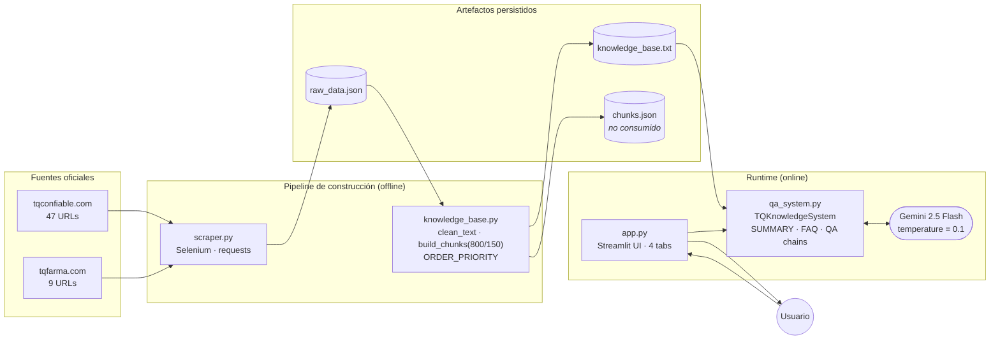
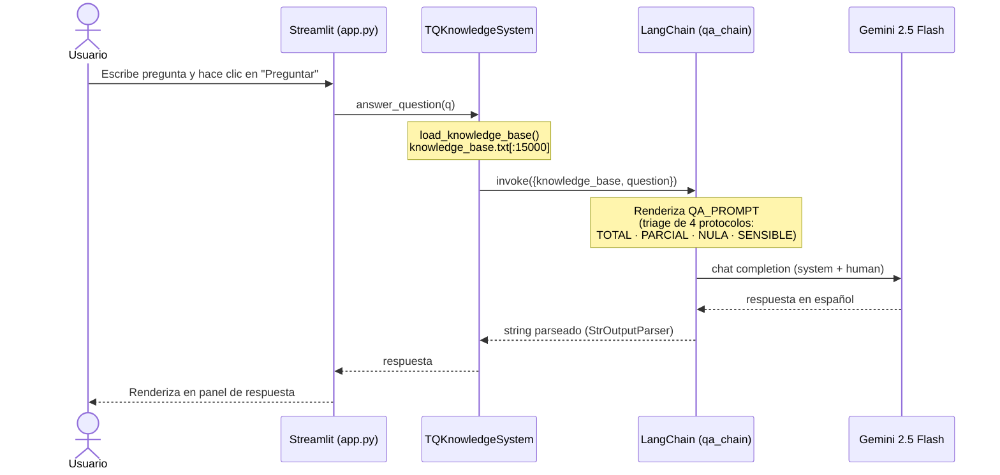

# TQ-Confiable — Asistente Virtual de Tecnoquímicas

Sistema de Preguntas y Respuestas (Q&A) sobre **Tecnoquímicas S.A. (TQ)** construido sobre Google Gemini 2.5 Flash y LangChain, con interfaz Streamlit. Trabajo académico para el **Taller 1 — Técnicas Avanzadas de IA Aplicadas en Modelos de Lenguaje**.

El sistema extrae información oficial de los sitios `tqconfiable.com` y `tqfarma.com`, la consolida en una base de conocimiento textual, y la usa como contexto único de un LLM para responder preguntas, generar un resumen ejecutivo y un panel de FAQ — todo con prompts diseñados para minimizar alucinaciones.

---

## Características

- **Q&A contextual** con protocolo de triage en 4 niveles (respuesta total, parcial, no disponible, tema sensible).
- **Resumen ejecutivo** estilo C-suite (350–450 palabras) generado a partir de la base de conocimiento.
- **FAQ automático** con 20 preguntas distribuidas por audiencia (clientes, inversionistas, talento).
- **Web scraping de dos motores**: Selenium + Chrome headless para `tqconfiable.com` (renderizado JS) y `requests` + BeautifulSoup para `tqfarma.com`.
- **Anti-alucinación**: el modelo responde exclusivamente con datos del contexto cargado; los prompts incluyen un *quality gate* de auto-auditoría.
- **Interfaz Streamlit** con tema oscuro corporativo y cuatro pestañas (Q&A, Resumen, FAQ, Arquitectura).

---

## Stack tecnológico

| Componente | Tecnología |
|---|---|
| LLM | Google Gemini 2.5 Flash (`gemini-2.5-flash`, `temperature=0.1`) |
| Orquestación | LangChain (`langchain-core`, `langchain-google-genai`) |
| Scraping JS | Selenium 4 + Chrome headless + `webdriver-manager` |
| Scraping HTTP | `requests` + BeautifulSoup 4 |
| UI | Streamlit |
| Lenguaje | Python 3.14 |
| Variables de entorno | `python-dotenv` |

---

## Estructura del repositorio

El repositorio tiene dos niveles: la **raíz** contiene metadata del proyecto Python, mientras que el **subdirectorio `tq_chatbot/`** contiene el código de la aplicación.

**Raíz del repositorio:**

| Archivo | Rol |
|---|---|
| `pyproject.toml` | Metadata del proyecto y dependencias (uv / pip) |
| `uv.lock` | Lock file de `uv` |
| `main.py` | Stub — no es el entrypoint real |
| `README.md` | Este archivo |
| `CLAUDE.md` | Guía para Claude Code |

**Subdirectorio `tq_chatbot/` — código de la aplicación:**

| Archivo | Etapa | Rol |
|---|---|---|
| `scraper.py` | 1 | Scraping de `tqconfiable.com` (Selenium) y `tqfarma.com` (requests) |
| `knowledge_base.py` | 2 | Limpieza, deduplicación y chunking del texto extraído |
| `qa_system.py` | 3 | Cadenas LangChain + 3 prompts (`SUMMARY`, `FAQ`, `QA`) |
| `app.py` | 4 | Interfaz Streamlit con 4 pestañas |
| `requirements.txt` | — | Dependencias (alternativa al `pyproject.toml` raíz) |
| `raw_data.json` | generado | Salida de `scraper.py` |
| `knowledge_base.txt` | generado | Salida de `knowledge_base.py` (consumido por `qa_system.py`) |
| `chunks.json` | generado | Salida de `knowledge_base.py` (no consumido actualmente) |
| `.env` | manual | Debe contener `GOOGLE_API_KEY` |

> **Importante:** todos los scripts usan rutas relativas. Ejecútalos desde el subdirectorio `tq_chatbot/`, no desde la raíz del repositorio.

---

## Instalación

### Requisitos previos

- Python 3.14
- Google Chrome o Chromium instalado localmente (para Selenium)
- Una API Key de Google Gemini — [obtenla gratis aquí](https://aistudio.google.com/app/apikey)

### 1. Clonar e instalar dependencias

```bash
git clone <url-del-repo>
cd tq_chatbot/tq_chatbot
pip install -r requirements.txt
```

Alternativa con `uv` desde la raíz:

```bash
uv sync
```

### 2. Configurar la API Key

Crea un archivo `.env` dentro de `tq_chatbot/tq_chatbot/`:

```env
GOOGLE_API_KEY=AIzaSy_TU_CLAVE_AQUI
```

Para despliegue en Streamlit Cloud, alternativamente puedes definir el secreto en `.streamlit/secrets.toml`:

```toml
GOOGLE_API_KEY = "AIzaSy_TU_CLAVE_AQUI"
```

`qa_system.py` intentará primero `st.secrets`, y si no existe usará la variable de entorno cargada desde `.env`.

---

## Uso

El proyecto sigue una **pipeline de 3 etapas que debe ejecutarse en orden**, ya que cada paso depende del archivo generado por el anterior.

```bash
cd tq_chatbot          # entrar al subdirectorio de código

# Etapa 1: Scraping (~5–10 min, requiere conexión y Chrome)
python scraper.py

# Etapa 2: Construcción de la Knowledge Base (segundos)
python knowledge_base.py

# Etapa 3: Levantar la interfaz Streamlit
python -m streamlit run app.py
```

La aplicación abrirá en `http://localhost:8501`.

### Qué genera cada etapa

| Etapa | Entrada | Salida |
|---|---|---|
| `scraper.py` | URLs de `tqconfiable.com` y `tqfarma.com` (hardcoded) | `raw_data.json` |
| `knowledge_base.py` | `raw_data.json` | `knowledge_base.txt`, `chunks.json` |
| `app.py` | `knowledge_base.txt` + `GOOGLE_API_KEY` | UI en Streamlit |

> Los archivos `raw_data.json`, `knowledge_base.txt` y `chunks.json` ya vienen incluidos en el repositorio, por lo que puedes saltarte directamente a `streamlit run app.py` si solo quieres probar la interfaz.

---

## Arquitectura

El sistema combina una **pipeline de construcción offline** (scraping → consolidación de la base de conocimiento) con una **interacción online** entre el usuario y Gemini mediada por LangChain. Por eso se documenta con dos diagramas complementarios: un **flowchart** para la arquitectura de datos y un **sequence diagram** para el runtime de Q&A.

### Diagrama de arquitectura — pipeline de datos



### Diagrama de secuencia — runtime de una pregunta



> Las pestañas **Resumen Ejecutivo** y **FAQ** siguen el mismo patrón pero invocan `summary_chain` y `faq_chain` respectivamente, sin parámetro `question`.

### Notas de diseño

- **Sin RAG ni vector store.** El sistema inyecta la base de conocimiento completa (truncada a **15 000 caracteres** en `qa_system.load_knowledge_base`) en el *system prompt* de cada llamada al LLM. Esto es *zero-shot grounding*. Aunque `chunks.json` se genera con metadatos para retrieval, **actualmente no se usa**.
- **Orden de secciones controlado.** `ORDER_PRIORITY` en `knowledge_base.py` define el orden con que las secciones se concatenan en `knowledge_base.txt`: identidad corporativa primero, noticias al final. Esto influye en qué información sobrevive al truncamiento de 15 000 caracteres.
- **Tres prompts especializados** (`SUMMARY_PROMPT`, `FAQ_PROMPT`, `QA_PROMPT`) escritos íntegramente en español, con fases explícitas (razonamiento interno → estructura del output → quality gate) y reglas anti-alucinación. Son el principal artefacto del proyecto.
- **Protocolo de seguridad** en `QA_PROMPT`: temas sensibles (alertas sanitarias, retiros, litigios) son redirigidos a canales oficiales sin confirmar ni desmentir.

---

## Fuentes de datos

Todas las URLs scrapeadas son **fuentes oficiales** de Tecnoquímicas:

- **`tqconfiable.com`** — sitio corporativo principal: identidad, misión/visión, historia, innovación, sostenibilidad, ofertas laborales, contacto, gobierno corporativo y un archivo completo de noticias.
- **`tqfarma.com`** — portal médico oficial: vademécum (MK / OTC), medicamentos A–Z, biblioteca científica, guías de práctica clínica.

Las listas completas de URLs están en `URLS_SELENIUM` y `URLS_REQUESTS` dentro de `scraper.py`.

---

## Personalización

### Añadir una nueva sección al scraping

1. Agregar la URL a `URLS_SELENIUM` o `URLS_REQUESTS` en `scraper.py` (usar prefijo `tqfarma_` si la fuente es tqfarma.com — `knowledge_base.py` lo usa para etiquetar el origen).
2. Añadir la nueva clave de sección a `ORDER_PRIORITY` en `knowledge_base.py` para controlar su posición; si no se añade, queda al final.
3. Re-ejecutar la pipeline: `python scraper.py && python knowledge_base.py`.

### Modificar los prompts

Los prompts viven en `qa_system.py` (`SUMMARY_PROMPT`, `FAQ_PROMPT`, `QA_PROMPT`). Mantener:

- División system/human de `ChatPromptTemplate.from_messages`.
- Placeholders `{knowledge_base}` (todos) y `{question}` (solo `QA_PROMPT`).
- Idioma español.

### Ajustar el truncamiento de la KB

En `qa_system.load_knowledge_base()`, el slice `[:15000]` limita cuánto contexto recibe el LLM. Si la KB crece o cambias de modelo, ajusta este valor (Gemini 2.5 Flash soporta contextos mucho más grandes).

---

## Métricas actuales de la Knowledge Base

- ~48.630 caracteres de texto consolidado
- 72 chunks semánticos (chunk size 800, overlap 150)
- 56 URLs procesadas de fuentes oficiales

> Estos valores también aparecen hardcoded en la pestaña "Arquitectura" de `app.py` y deben actualizarse manualmente si la KB se regenera con tamaños distintos.

---

## Limitaciones conocidas

- El truncamiento a 15 000 caracteres en `load_knowledge_base` puede dejar fuera secciones de menor prioridad (típicamente noticias antiguas).
- `chunks.json` se genera pero no se consume — no hay retrieval semántico implementado.
- El scraper depende de la estructura HTML actual de los sitios; cambios en el frontend de TQ requerirán ajustes en `extract_text` o en el listado de términos de navegación (`NAV_EXACT`).
- Selenium requiere Chrome instalado localmente y conexión saliente a internet para `webdriver-manager`.

---

## Licencia

Proyecto académico. Los datos extraídos pertenecen a **Tecnoquímicas S.A.** y se usan únicamente con fines educativos.
