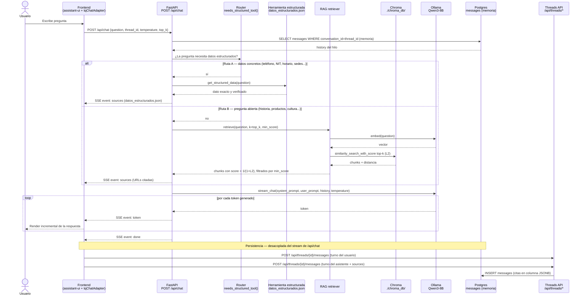
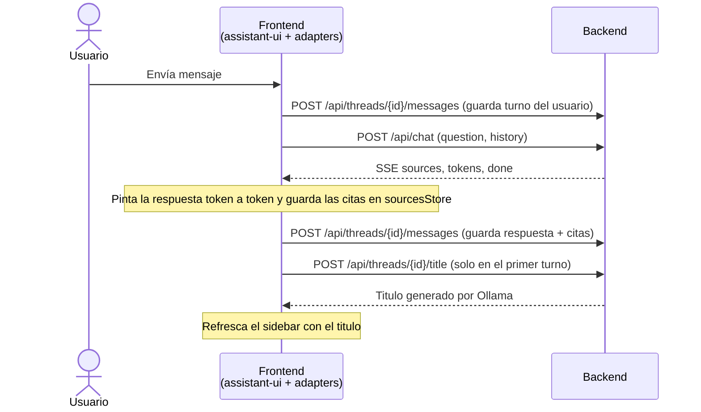
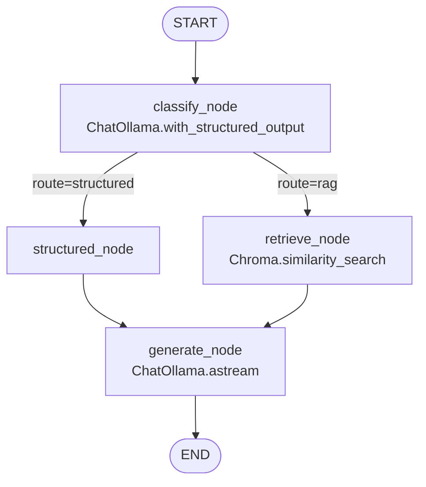
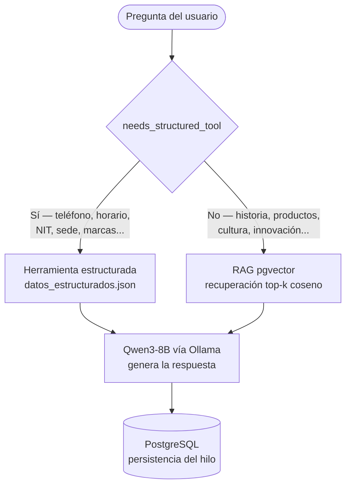

# TQ-Chatbot

Chatbot RAG sobre Tecnoquímicas S.A. - backend en FastAPI, modelo local Qwen3-8B vía Ollama, vector store en Postgres + pgvector, y un widget de burbuja flotante en cualquier landing.

> **Estado:** Reescritura completa desde cero (mayo 2026). El proyecto anterior (Streamlit + inyección de KB en prompt) fue reemplazado.

## Objetivos

1. **RAG real**: vector search sobre chunks embebidos en Chroma, citando fuentes en cada respuesta.
2. **100 % local**: LLM, embeddings y vector store corren en la máquina del desarrollador (M1 Pro 16 GB target).
3. **Reproducible**: `docker compose up` levanta todo. Sin "funciona en mi máquina".
4. **Pipeline manual e idempotente**: dos scripts (`fetch_sitemaps.py`, `ingest_to_rag.py`) se ejecutan a mano, pueden re-correrse sin efectos secundarios (IDs deterministas vía `uuid5(NAMESPACE_URL, "<url>#<idx>")`).
5. **Agente con router**: el sistema decide en cada turno entre herramienta RAG o herramienta de datos estructurados segun la naturaleza de la pregunta.
6. **Memoria por hilo**: cuando el cliente envía `thread_id`, el backend reconstruye el historial desde la tabla `messages` antes de invocar al LLM.

## Stack

| Capa | Tecnología |
|---|---|
| Runtime | Python 3.12, `uv` |
| API | FastAPI + Pydantic v2 |
| LLM | Qwen3-8B-Instruct vía Ollama (`apps/api/llm/ollama_client.py`) |
| Embeddings | Qwen3-Embedding-0.6B vía `langchain-community` `OllamaEmbeddings` |
| Vector DB | Chroma persistente (`./chroma_db/`, `langchain-community.vectorstores.Chroma`) |
| Persistencia de hilos | PostgreSQL 16 (`conversations`, `messages`) + asyncpg |
| Scraping | [webclaw](https://github.com/0xMassi/webclaw) (Rust CLI) - `brew install` |
| Chunking | LangChain `RecursiveCharacterTextSplitter` |
| Orquestación | LangGraph `StateGraph` con 4 nodos (`apps/api/graph/`) |
| Memoria por hilo | `AsyncPostgresSaver` — checkpoints keyed por `thread_id` |
| Monitoreo | LangSmith (opcional, vía env vars `LANGSMITH_*`) |
| Frontend | Next.js 15 (App Router) + React 19 + [assistant-ui](https://www.assistant-ui.com/) + Tailwind 3 |
| Streaming | SSE (Server-Sent Events) - parser custom dentro del `ChatModelAdapter` |
| Herramienta estructurada | `datos_estructurados.json` + `structured_tool.py` |
| Router / Agente | `classify` node con `ChatOllama.with_structured_output(RouteDecision)` |
| Panel de parámetros | Sliders de `temperature` y `top_k` por turno (`SettingsPanel.tsx`) |
| Infra | docker-compose |

Detalles y razones en [`docs/ARCHITECTURE.md`](docs/ARCHITECTURE.md).

## Cómo funciona el sistema

Diagrama de secuencia de un turno de conversación, desde que el usuario escribe hasta que la respuesta queda persistida. El agente enruta cada pregunta a una de dos herramientas y el streaming SSE es independiente de la persistencia de hilos.



## Flujo del frontend

El frontend usa [assistant-ui](https://www.assistant-ui.com/) como conjunto de primitivos de chat y le enchufa tres adaptadores propios, más un store lateral para las citas:

| Pieza | Tipo assistant-ui | Responsabilidad |
|---|---|---|
| `lib/tqChatAdapter.ts` | `ChatModelAdapter` | Llama a `/api/chat`, parsea el SSE y emite el contenido acumulado del modelo. |
| `lib/threadHistoryAdapter.ts` | `ThreadHistoryAdapter` | Persiste (`append`) e hidrata (`load`) los mensajes de un hilo vía `/api/threads/*`. |
| `lib/threadListAdapter.tsx` | `RemoteThreadListAdapter` | Lista, crea, renombra, archiva y **titula** hilos en el sidebar. |
| `lib/sourcesStore.ts` | Zustand (canal lateral) | Mapa `messageId → Source[]`. Las citas no viajan en el content stream del modelo. |

Flujo de información de un turno, en versión resumida:



### Generación del título del hilo

Un hilo nuevo nace como `"Nueva conversación"` — es lo que devuelven `initialize`/`create_thread`. El título "real" llega después, por un canal separado del chat:

1. Tras completarse el primer intercambio, assistant-ui llama a `threadListAdapter.generateTitle(remoteId, messages)`.
2. Ese método hace `POST /api/threads/{id}/title` con los primeros mensajes del hilo.
3. El backend (`routers/threads.py` → `generate_title`) le pide a **Ollama** un título corto (máx. 6 palabras, español), lo limpia de comillas/prefijos y lo **persiste** con un `UPDATE conversations`.
4. El frontend recibe el título y llama a `reloadThreadList()` para que el sidebar deje de mostrar "Nueva conversación".

Es decir: el titulado **no** lo hace el endpoint de chat ni el `ChatModelAdapter` — es responsabilidad del `RemoteThreadListAdapter` y ocurre una sola vez, al final del primer turno.

### Hidratación al abrir un hilo

Al abrir o recargar un hilo, `MyRuntimeProvider` remonta el `RuntimeScope` con el `threadId` de la URL, el `ThreadHistoryAdapter.load()` pide `GET /api/threads/{id}/messages`, re-hidrata el `sourcesStore` con `bulkSet` y devuelve el repositorio de mensajes que assistant-ui renderiza.

## Prerrequisitos

- Docker Desktop con >= 8 GB asignados (recomendado 12 GB)
- ~10 GB de disco libre para modelos
- Python 3.12 + `uv` (sólo para correr los scripts de fetch/ingest desde host)
- [`webclaw`](https://github.com/0xMassi/webclaw) en el PATH para el script de scraping:
  ```bash
  brew install 0xMassi/webclaw/webclaw
  ```

## Quickstart

```bash
# 1. Configurar entorno
cp .env.example .env

# 2. Levantar stack (postgres + api). Primer arranque crea las tablas (incluye conversations/messages).
docker compose up -d

# 3. Scrapear sitios (idempotente - re-ejecutable). Requiere `webclaw` instalado.
uv sync
uv run python scripts/fetch_sitemaps.py --site all

# 4. Indexar al RAG (idempotente)
uv run python scripts/ingest_to_rag.py

# 5. Levantar el frontend (Next.js + assistant-ui)
cd frontend
cp .env.local.example .env.local        # apunta a http://localhost:8000
pnpm install
pnpm dev                                # http://localhost:3000

# 6. Abrir el chat
open http://localhost:3000
```

> El API queda en `http://localhost:8000` (FastAPI, sólo `/api/*`). El frontend
> consume `NEXT_PUBLIC_API_BASE`. CORS ya permite ambos orígenes en dev.

## Comandos útiles

```bash
# Re-fetch forzado (ignora content_hash existente)
uv run python scripts/fetch_sitemaps.py --site all --force

# Sólo un sitio
uv run python scripts/fetch_sitemaps.py --site tqfarma

# Ingesta dry-run (cuenta cambios sin escribir)
uv run python scripts/ingest_to_rag.py --dry-run

# Reset total del RAG
uv run python scripts/reset_rag.py

# Health check
curl http://localhost:8000/api/health
```

## Estructura

```
.
+-- apps/api/              FastAPI app
|   +-- core/              config + Postgres pool
|   +-- routers/           /api/chat (SSE), /api/health, /api/threads (persistencia UI)
|   |   +-- chat_v2.py     endpoint con router agente + memoria por thread_id
|   +-- rag/               retriever (Chroma), prompt, corpus_stats
|   +-- llm/               cliente Ollama (streaming + completar)
|   +-- tools/             herramienta de datos estructurados
|   +-- datos_estructurados.json   datos exactos de TQ
+-- chroma_db/             persist directory de Chroma (gitignored, generado por ingest)
+-- frontend/              Next.js + assistant-ui
|   +-- app/               layout + page (sidebar + chat)
|   +-- components/        ThreadList, Thread, Composer, Messages, SourcesFooter
|   +-- lib/               tqChatAdapter, threadListAdapter, sourcesStore, sse, api
+-- scripts/               fetch_sitemaps.py, ingest_to_rag.py, reset_rag.py
+-- migrations/            001_init.sql, 002_conversations.sql (auto-aplicados)
+-- data/                  raw + processed (gitignored)
+-- docs/ARCHITECTURE.md   decisiones (ADRs)
+-- docker-compose.yml
+-- pyproject.toml
```

## Variables de entorno

Ver `.env.example`. Las más importantes:

| Variable | Default | Notas |
|---|---|---|
| `LLM_MODEL` | `qwen3:8b` | Cambiar a `qwen3:4b` si tienes < 12 GB de RAM. |
| `EMBED_MODEL` | `qwen3-embedding:0.6b` | Ollama debe tener el tag descargado (`ollama pull qwen3-embedding:0.6b`). |
| `TOP_K` | `6` | Chunks recuperados por consulta (override per-request desde el slider del frontend). |
| `MIN_SCORE` | `0.40` | Umbral de relevancia tras transformar L2 → `1/(1+L2)`. Recalibrar tras reingestar. |
| `CHROMA_PATH` | `./chroma_db` | Persist directory de Chroma. Compartido entre host y contenedor vía bind mount. |
| `OLLAMA_HOST` | `http://host.docker.internal:11434` | Dentro de Docker (Ollama nativo en macOS). Desde host: `http://localhost:11434`. |
| `DATABASE_URL` | `postgresql://tq:tq@postgres:5432/tq` | Postgres guarda `conversations`, `messages` (UI) y los `checkpoints` de LangGraph (memoria del grafo). Usa `localhost` desde host. |
| `LLM_ROUTER_MODEL` | _vacío_ | Modelo opcional para el nodo `classify`. Si vacío, usa `LLM_MODEL`. Útil para bajar a `qwen3:1.7b` y acelerar el routing. |
| `LANGSMITH_TRACING` | `false` | Setear `true` para enviar traces a LangSmith. Requiere también `LANGSMITH_API_KEY`. |
| `LANGSMITH_API_KEY` | _vacío_ | API key de LangSmith. Sin esto, el tracing queda apagado aunque `LANGSMITH_TRACING=true`. |
| `LANGSMITH_PROJECT` | `tq-chatbot` | Nombre del proyecto en LangSmith donde aparecen los traces. |
| `LANGSMITH_ENDPOINT` | `https://api.smith.langchain.com` | Sobrescribir sólo para self-hosted. |

## LangGraph + LangSmith

La orquestación del agente (router, retrieval, generación y memoria por hilo) está implementada como un `StateGraph` de LangGraph en `apps/api/graph/`:

| Archivo | Rol |
|---|---|
| `apps/api/graph/state.py` | `ChatState` (TypedDict con reductor `add_messages`) y `RouteDecision` (Pydantic, salida del clasificador). |
| `apps/api/graph/llm.py` | Fábricas de `ChatOllama` para el LLM principal y el clasificador del router. |
| `apps/api/graph/nodes.py` | `classify`, `structured`, `retrieve`, `generate` + función de la conditional edge. |
| `apps/api/graph/build.py` | Ensambla el `StateGraph` y compila con el checkpointer. |



**Memoria por hilo.** `AsyncPostgresSaver` corre `setup()` la primera vez y crea las tablas `checkpoints`, `checkpoint_blobs` y `checkpoint_writes` en la misma base de datos que `conversations`/`messages` (responsabilidades distintas: las primeras son estado del grafo; las segundas son lo que renderiza la UI). Cada turno se invoca el grafo con `configurable={"thread_id": <uuid>}`; LangGraph carga el estado previo, ejecuta los nodos y guarda el nuevo state. El reductor `add_messages` del campo `messages` se encarga del append idempotente.

**Tracing con LangSmith.** Es 100% configurado por variables de entorno: el lifespan de `apps/api/main.py` exporta `LANGSMITH_*` a `os.environ` antes de importar `langgraph`. Setup:

```bash
# 1. Obtener API key en https://smith.langchain.com (cuenta gratis).
# 2. Setear en .env o en el shell:
export LANGSMITH_TRACING=true
export LANGSMITH_API_KEY=lsv2_pt_xxx
export LANGSMITH_PROJECT=tq-chatbot

# 3. Reiniciar el stack para que el lifespan recoja las variables.
docker compose up -d --force-recreate api

# 4. Hacer una pregunta desde el frontend e ir al proyecto `tq-chatbot`
#    en LangSmith: verás el trace classify → (structured|retrieve) → generate
#    con cada llamada a Ollama anidada.
```

Cuando `LANGSMITH_TRACING=false` o falta la API key, el grafo corre sin enviar nada al servicio externo — útil en CI o desarrollo offline.

## Herramienta de Datos Estructurados

El archivo `apps/api/datos_estructurados.json` contiene datos exactos y verificados de Tecnoquimicas: telefono, horario, NIT, sedes, marcas y lineas de negocio.

La funcion `get_structured_data(question)` en `apps/api/tools/structured_tool.py` recupera el dato preciso segun la intencion de la pregunta. A diferencia del RAG, esta herramienta es determinista y no usa embeddings ni base vectorial.

| Pregunta | Herramienta | Respuesta |
|---|---|---|
| Cual es el telefono de atencion? | Estructurada | 01 8000 912 808 |
| Cual es el horario? | Estructurada | Lun-Vie 7am-7pm, Sab 8am-1pm |
| Cual es el NIT? | Estructurada | 890.300.279-7 |
| Donde estan las sedes? | Estructurada | Cra 28 #1-50, Acopi-Yumbo |
| Cual es la historia de TQ? | RAG (pgvector) | Respuesta desde documentos |
| Que programas de sostenibilidad tiene? | RAG (pgvector) | Respuesta desde documentos |

## Router del Agente

El endpoint `apps/api/routers/chat_v2.py` implementa el agente enrutador. En cada turno, la funcion `needs_structured_tool(question)` analiza la pregunta por palabras clave y decide la ruta:



## Pruebas de Validación del Agente

| Tipo | Pregunta | Herramienta esperada |
|---|---|---|
| RAG | Cual es la historia de Tecnoquímicas? | RAG (pgvector) |
| Memoria | Y cuando fue eso? (tras respuesta previa) | RAG con historial |
| Herramienta estructurada | Cual es el teléfono de servicio al cliente? | datos_estructurados.json |
| Enrutamiento | Cual es el horario? / Que productos tienen? | Estructurada / RAG |

## Integrantes

- Daniel Felipe Zamora
- Diego Mauricio Ortiz
- Jacob González
- Jairo Andrés Pérez Hurtatis

Maestría en Inteligencia Artificial y Ciencia de Datos
Universidad Autónoma de Occidente - UAO
Profesor: Jan Polanco Velasco

## Contribuir

Convención de commits: `tipo(scope): mensaje en español` (`feat`, `fix`, `chore`, `docs`, `refactor`).

Idioma: todo el contenido user-facing (prompts, UI, mensajes de error) está en **español**. Los identificadores de código siguen en inglés.
