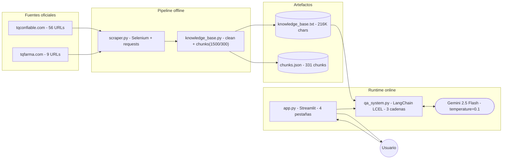
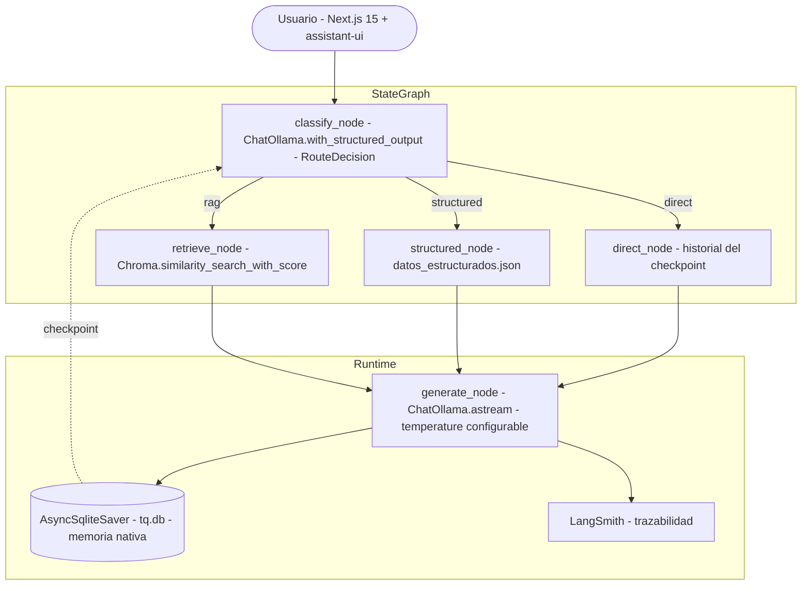
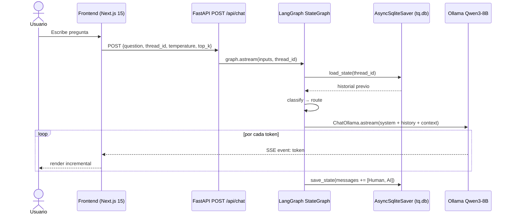
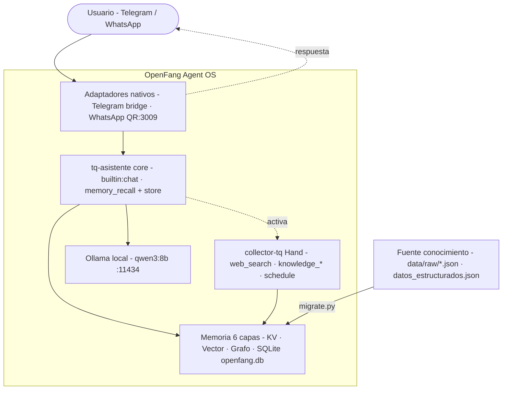

# TQ-Asistente - Agente Corporativo para Tecnoquímicas S.A.

> **Módulo 3 (actual):** Agent OS OpenFang - Telegram + WhatsApp + Hand autónomo `collector-tq`.
> Evolución completa desde un Q&A estático (M1) hasta un agente productivo en canales reales (M3).

Sistema conversacional corporativo para **Tecnoquímicas S.A. (TQ Confiable / tqfarma)** construido en tres módulos progresivos como parte del curso *Técnicas Avanzadas de IA Aplicadas en Modelos de Lenguaje* - Maestría en IA y Ciencias de Datos, UAO.

**Integrantes:** Daniel Felipe Zamora · Diego Mauricio Ortiz · Jacob González · Jairo Andrés Pérez Hurtatis
**Profesor:** Jan Polanco Velasco

---

## Tabla de Contenidos

- [Evolución del Proyecto](#evolución-del-proyecto)
- [Módulo 1 - Sistema Q&A Semántico](#módulo-1--sistema-qa-semántico)
- [Módulo 2 - Agente RAG con LangGraph](#módulo-2--agente-rag-con-langgraph)
- [Módulo 3 - Agent OS con OpenFang](#módulo-3--agent-os-con-openfang)
- [Quickstart M3 (estado actual)](#quickstart-m3-estado-actual)
- [Estructura del Repositorio](#estructura-del-repositorio)

---

## Evolución del Proyecto

Cada módulo aplicó la **Navaja de Ockham**: mayor funcionalidad con menor complejidad de infraestructura.

| Componente | M1 | M2 | M3 |
|---|---|---|---|
| LLM | Gemini 2.5 Flash (cloud) | Qwen3-8B (local) | Qwen3-8B (local) |
| Embeddings | Ninguno | Qwen3-Embedding-0.6B | Qwen3-Embedding-0.6B |
| Vector store | Ninguno | Chroma local | Memoria 6 capas OS |
| Orquestación | LangChain LCEL | LangGraph StateGraph | OpenFang Agent OS |
| Memoria | Sin memoria | AsyncSqliteSaver (SQLite) | Checkpointer nativo OS |
| Interfaz | Streamlit | Next.js 15 + assistant-ui | Telegram + WhatsApp |
| API | Directa | FastAPI + SSE | Bridges nativos OS |
| Autonomía | Reactivo | Reactivo | Proactivo (Hand 24/7) |
| Observabilidad | Ninguna | LangSmith | Dashboard + Hand metrics |
| Infraestructura | Cloud API | Sin Docker | Binario único ~32 MB |
| Precisión factual | 80% (20 preguntas) | Router LLM 3 rutas | Protocolo SENSIBLE portado |

---

## Módulo 1 - Sistema Q&A Semántico

**Objetivo:** construir la base de conocimiento corporativo y un sistema Q&A con cero alucinaciones.

### El Problema

Tecnoquímicas - con 90 años de historia, 8.200 colaboradores, presencia en 20+ países y 4.000+ referencias de producto - carecía de un canal automatizado que centralizara su conocimiento para responder consultas en tiempo real. Un usuario debía navegar decenas de páginas manualmente.

### Arquitectura M1


```mermaid
flowchart LR
    subgraph Sources["Fuentes oficiales"]
        S1["tqconfiable.com - 56 URLs"]
        S2["tqfarma.com - 9 URLs"]
    end

    subgraph Build["Pipeline offline"]
        SC["scraper.py - Selenium + requests"]
        KB["knowledge_base.py - clean + chunks(1500/300)"]
    end

    subgraph Artifacts["Artefactos"]
        KT[("knowledge_base.txt - 216K chars")]
        CJ[("chunks.json - 331 chunks")]
    end

    subgraph Runtime["Runtime online"]
        QS["qa_system.py - LangChain LCEL - 3 cadenas"]
        GM(["Gemini 2.5 Flash - temperature=0.1"])
        APP["app.py - Streamlit - 4 pestañas"]
    end

    S1 --> SC --> KB --> KT --> QS <--> GM
    S2 --> SC
    KB --> CJ
    APP --> QS
    User((Usuario)) --> APP --> User
```

### Stack M1

| Componente | Tecnología |
|---|---|
| LLM | Google Gemini 2.5 Flash (`temperature=0.1`) |
| Orquestación | LangChain LCEL - patrón `prompt \| llm \| StrOutputParser()` |
| Scraping JS | Selenium 4 + Chrome headless + `webdriver-manager` |
| Scraping HTTP | `requests` + BeautifulSoup 4 |
| Interfaz | Streamlit con 4 pestañas |
| Lenguaje | Python 3.14 |

### Knowledge Base

Se implementaron dos motores de scraping según la naturaleza de cada fuente:
- **Motor Selenium** para `tqconfiable.com` (56 URLs): renderizado JS con `navigator.webdriver` override y User-Agent real de Chrome 120.
- **Motor requests** para `tqfarma.com` (9 URLs): portal médico accesible vía HTTP estándar.

| Métrica | V1 Preliminar | V2 Final |
|---|---|---|
| URLs procesadas | 12 | 65 |
| Caracteres totales | 48,630 | 216,611 |
| Chunks semánticos | 72 | 331 |
| Tamaño de chunk | 800 chars | 1,500 chars |
| Overlap | 150 chars | 300 chars |
| Truncamiento contexto | 15,000 chars | Completo |

### Sistema de Prompts con Protocolo SENSIBLE

Se diseñaron tres prompts con Chain-of-Thought y quality gate interno:

- **`SUMMARY_PROMPT`** - resumen ejecutivo estilo C-suite (350–450 palabras) con 6 fases internas de razonamiento.
- **`FAQ_PROMPT`** - 20 preguntas con distribución obligatoria por audiencia (cliente, inversionista, talento).
- **`QA_PROMPT`** - Q&A con protocolo de triage en 4 niveles:

| Protocolo | Cuándo | Acción |
|---|---|---|
| TOTAL | Respuesta completa en contexto | Responde con todos los datos |
| PARCIAL | Datos relacionados pero incompletos | Responde con lo disponible |
| NULA | Tema fuera del corpus | Informa que no tiene esa información |
| **SENSIBLE** | **Salud, retiros, litigios, INVIMA** | **Redirige a canales oficiales sin confirmar ni negar** |

> El protocolo SENSIBLE es crítico para una farmacéutica: alucinar un dato de salud o confirmar un retiro de producto es un riesgo legal inaceptable. Este protocolo se portó a los Módulos 2 y 3.

### Resultados M1

- **80%** de precisión factual en 20 preguntas de evaluación
- **0** alucinaciones detectadas
- 3 respuestas parciales (15%), 1 fallback (5%)

### Quickstart M1

```bash
cd tq_chatbot
python scraper.py          # ~5-10 min, requiere Chrome
python knowledge_base.py
python -m streamlit run app.py
# Abre: http://localhost:8501
```

Demo en Streamlit Cloud: https://tq-chatbot-taaml.streamlit.app

---

## Módulo 2 - Agente RAG con LangGraph

**Objetivo:** reemplazar el contexto estático por RAG real, agregar memoria persistente y routing inteligente.

### Mejoras respecto al M1

1. **RAG real** con Chroma: solo los chunks semánticamente relevantes llegan al LLM (de 216K a ~6K chars por consulta).
2. **Router LLM** con 3 rutas: `direct` (historial), `structured` (datos exactos), `rag` (semántico).
3. **Memoria persistente** entre sesiones con `AsyncSqliteSaver` - el modelo recuerda el nombre del usuario al reabrir un hilo.
4. **Parámetros configurables** en el frontend: sliders de `temperature` (0.0–1.0) y `top_k` (1–10).
5. **LangSmith** para trazabilidad completa de cada invocación del grafo.
6. **Sin Docker**: SQLite + Chroma corren como archivos locales del host.

### Arquitectura M2 - StateGraph de LangGraph


```mermaid
flowchart TD
    U([Usuario - Next.js 15 + assistant-ui]) --> CL

    subgraph StateGraph
        CL[classify_node - ChatOllama.with_structured_output - RouteDecision]
        CL -->|direct| DR[direct_node - historial del checkpoint]
        CL -->|structured| ST[structured_node - datos_estructurados.json]
        CL -->|rag| RT[retrieve_node - Chroma.similarity_search_with_score]
    end

    subgraph Runtime
        GN[generate_node - ChatOllama.astream - temperature configurable]
        CP[(AsyncSqliteSaver - tq.db - memoria nativa)]
        LS[LangSmith - trazabilidad]
    end

    DR --> GN
    ST --> GN
    RT --> GN
    GN --> CP
    GN --> LS
    CP -.->|checkpoint| CL
```

### RAG con Chroma y Qwen3-Embedding

**Chroma** persiste embeddings en `./chroma_db/` sin servidor externo. La búsqueda opera sobre distancia L2 transformada a similitud: $score = \frac{1}{1 + d_{L2}}$, con umbral `min_score=0.40`.

**Qwen3-Embedding-0.6B** (1024 dimensiones) - elegido por:
- Top de MTEB 2025 en español entre modelos open-source pequeños
- 600 MB de memoria vs 2.3 GB de BGE-M3
- Misma familia de tokenización que Qwen3-8B para consistencia semántica

### Router con Salida Estructurada

```python
class RouteDecision(BaseModel):
    route: Literal["direct", "structured", "rag"]

# En classify_node:
structured_llm = router_llm.with_structured_output(RouteDecision)
decision = await structured_llm.ainvoke(messages)
```

El clasificador LLM supera al router de palabras clave en cobertura de sinónimos y negaciones. Regla de desempate: si hay duda entre `rag` y `direct`, se prefiere `direct` (barato; el usuario puede reformular).

### Memoria Persistente entre Sesiones

`AsyncSqliteSaver` serializa el `ChatState` completo en SQLite tras cada turno. Al reabrir un hilo con el mismo `thread_id`, LangGraph restaura automáticamente el estado - el modelo recuerda el nombre del usuario entre sesiones.

```python
checkpoint_conn = await aiosqlite.connect(settings.sqlite_path)
checkpointer = AsyncSqliteSaver(checkpoint_conn)
await checkpointer.setup()
graph = builder.compile(checkpointer=checkpointer)
```

### Diagrama de Secuencia M2


```mermaid
sequenceDiagram
    actor U as Usuario
    participant FE as Frontend (Next.js 15)
    participant API as FastAPI POST /api/chat
    participant G as LangGraph StateGraph
    participant CP as AsyncSqliteSaver (tq.db)
    participant OL as Ollama Qwen3-8B

    U->>FE: Escribe pregunta
    FE->>API: POST {question, thread_id, temperature, top_k}
    API->>G: graph.astream(inputs, thread_id)
    G->>CP: load_state(thread_id)
    CP-->>G: historial previo
    G->>G: classify → route
    G->>OL: ChatOllama.astream(system + history + context)
    loop por cada token
        OL-->>FE: SSE event: token
        FE-->>U: render incremental
    end
    G->>CP: save_state(messages += [Human, AI])
```

### LangSmith - Observabilidad

```bash
# En .env:
LANGSMITH_TRACING=true
LANGSMITH_API_KEY=lsv2_pt_xxxxxxxxxxxx
LANGSMITH_PROJECT=tq-chatbot

# Cada consulta genera un trace completo:
# chat → classify (ChatOllama) → retrieve (Chroma) → generate (ChatOllama)
```

### Stack M2

| Capa | Tecnología |
|---|---|
| API | FastAPI + Pydantic v2 |
| Orquestación | LangGraph `StateGraph` con 5 nodos |
| Router | `ChatOllama.with_structured_output(RouteDecision)` |
| LLM | Qwen3-8B vía Ollama |
| Embeddings | Qwen3-Embedding-0.6B vía `OllamaEmbeddings` |
| Vector DB | Chroma persistente en `./chroma_db/` |
| Memoria | `AsyncSqliteSaver` en `./tq.db` |
| Frontend | Next.js 15 + assistant-ui + Tailwind 3 |
| Streaming | SSE (Server-Sent Events) |
| Observabilidad | LangSmith (opcional vía env vars) |

### Quickstart M2

```bash
make install          # uv sync + pnpm install
make ingest           # indexa el corpus en Chroma
make backend          # uvicorn :8000
make frontend         # next dev :3000
# Abre: http://localhost:3000
```

### Pruebas de Validación M2

| Tipo | Pregunta | Ruta | Resultado |
|---|---|---|---|
| Conversacional | Hola | `direct` | Saludo sin retrieval |
| Memoria | ¿Cómo me llamo? (tras presentarse) | `direct` | Responde desde checkpoint |
| Structured | ¿Cuál es el teléfono? | `structured` | 01 8000 912 808 |
| RAG | ¿Cuál es la historia de TQ? | `rag` | Respuesta + chips de fuentes |
| Parámetros | temp=0.9, misma pregunta | `rag` | Respuesta más variada |

---

## Módulo 3 - Agent OS con OpenFang

**Objetivo:** productizar el agente desplegándolo en Telegram y WhatsApp con autonomía proactiva y soberanía de datos.

### ¿Por qué OpenFang y no seguir con FastAPI?

| Dimensión | M2 (FastAPI + LangGraph) | M3 (OpenFang Agent OS) |
|---|---|---|
| Runtime | Python + uvicorn | Rust ~32 MB, ~40 MB RAM |
| Seguridad tools | Proceso Python sin sandbox | WASM sandbox (fuel + epoch + mem limits) |
| Canales | Requiere webhook + SSL | Adaptadores nativos en `config.toml` |
| Memoria | AsyncSqliteSaver manual | 6 capas nativas del OS |
| Autonomía | Reactivo | Proactivo (Hands en background) |
| Sesiones multi-canal | No | Cross-channel nativo |
| Arranque | 2 procesos + Ollama | 1 proceso + Ollama |

Agregar WhatsApp en el M2 habría requerido servidor público, webhook de Meta y certificado SSL. En OpenFang fue una línea en `config.toml`.

### Arquitectura M3 - Agent OS

```
   Telegram ──┐                          ┌─────────────────────────┐
   WhatsApp ──┤  adaptadores nativos      │  tq-asistente (core)    │
   (38+ más) ─┘  [channels.*]  ─────────▶│  builtin:chat            │──▶ Ollama qwen3:8b
                                          │  memory_recall + store   │    :11434
                                          └─────────────────────────┘
                                                     │
                                          ┌─────────────────────────┐
                                          │  Memoria 6 capas        │
                                          │  KV · Vector · Grafo    │
                                          │  Sesiones · Tareas      │
                                          │  SQLite openfang.db     │
                                          └─────────────────────────┘
                                                     │
                                          ┌─────────────────────────┐
                                          │  collector-tq Hand      │
                                          │  web_search · OSINT     │
                                          │  knowledge_* · schedule │
                                          └─────────────────────────┘
```

### Diagrama End-to-End M3


```mermaid
flowchart TD
    U([Usuario - Telegram / WhatsApp]) --> BR

    subgraph OpenFang Agent OS
        BR[Adaptadores nativos - Telegram bridge · WhatsApp QR:3009]
        AG[tq-asistente core - builtin:chat · memory_recall + store]
        M6[Memoria 6 capas - KV · Vector · Grafo · SQLite openfang.db]
        HN[collector-tq Hand - web_search · knowledge_* · schedule]
        OL[Ollama local - qwen3:8b :11434]
    end

    DATA[Fuente conocimiento - data/raw/*.json · datos_estructurados.json]

    BR --> AG
    AG --> M6
    AG --> OL
    AG -.->|activa| HN
    HN --> M6
    DATA -->|migrate.py| M6
    BR -.->|respuesta| U
```

### Memoria de 6 Capas

El script `scripts/migrate_to_openfang.py` inyecta el conocimiento corporativo en dos canales idempotentes:

1. **Structured KV Store** vía REST (`PUT /api/memory/agents/{id}/kv/{key}`):
   - `identidad_corporativa`, `contacto`, `sedes`, `marcas`, `lineas_negocio`, `sostenibilidad`, `empleo`
   - Datos exactos verificados de `datos_estructurados.json`

2. **Vector Store** vía inserción directa en SQLite de OpenFang:
   - 1,442 documentos del corpus `data/raw/*.json`
   - Embeddings Qwen3-Embedding-0.6B serializados como BLOB f32 little-endian
   - Deduplicación por SHA-256, IDs deterministas `uuid5(url#i)`

```bash
make of-migrate
# KV store: 7 claves sembradas
# Vector store: 1.442 documentos indexados
```

### Agente tq-asistente

Definido en `agents/tq-asistente/agent.toml`:

- **Modelo:** `qwen3:8b` local, `temperature=0.2`, `max_tokens=4096`. Sin fallback cloud.
- **Tools:** `memory_recall` (búsqueda semántica + re-ranking coseno) y `memory_store`.
- **Protocolo SENSIBLE portado del M1:** temas de salud, retiros, litigios e INVIMA se redirigen a canales oficiales sin confirmar hechos.
- **Datos hardcoded en system prompt:** marcas, NIT, contacto, horario - alta frecuencia, sin tool call.

### Hand Autónomo: collector-tq (Perfil Analítico - Opción B)

Inteligencia competitiva farmacéutica autónoma. Definido en `hands/collector-tq/HAND.toml`.

**Tools OSINT:** `web_search`, `web_fetch`, `knowledge_add_entity`, `knowledge_add_relation`, `knowledge_query`, `schedule_create`, `memory_store`, `memory_recall`, `event_publish`.

**Playbook de 7 fases:**

```
Fase 1 → Recuperar estado previo (memory_recall de collector_tq_state)
Fase 2 → Inicializar objetivo y agenda de consultas
Fase 3 → Construir queries por focus_area (competitor/market/technology/business)
Fase 4 → Barrido OSINT (web_search + web_fetch, hasta max_sources_per_cycle fuentes)
Fase 5 → Construir grafo de conocimiento (entidades: Empresa/Producto/Evento/Cifra)
Fase 6 → Detectar cambios delta (crítico/importante/menor) + sentimiento de marca
Fase 7 → Persistir reporte Markdown/JSON + actualizar métricas del dashboard
```

**Guardrails farmacéuticos:** retiros, alertas INVIMA, litigios y farmacovigilancia se reportan como "señales a verificar" - nunca como hechos confirmados.

```bash
make of-hand
# Equivale a: openfang hand activate collector-tq
# Dashboard → http://127.0.0.1:4200 → Hands → collector-tq
```

### Canales de Mensajería

**Telegram** (long-polling, sin URL pública):
```toml
# config.toml
[channels.telegram]
bot_token_env = "TELEGRAM_BOT_TOKEN"
default_agent = "tq-asistente"
allowed_users = []  # vacío = todos
```
```bash
# En .env: TELEGRAM_BOT_TOKEN=tu_token_de_BotFather
# Activo automáticamente con make of-start
```

**WhatsApp** (modo web, gateway QR, puerto 3009):
```bash
make of-whatsapp
# Arranca gateway Node en :3009
# Dashboard → Channels → WhatsApp → escanear QR (igual que WhatsApp Web)
```

WhatsApp está listo para activar con `make of-whatsapp` y escanear el QR (igual que WhatsApp Web). Para despliegue productivo se recomienda la Meta Business API con número dedicado. El canal completamente validado en producción es **Telegram**.

### Stack M3

| Capa | Tecnología |
|---|---|
| Agent OS | OpenFang (Rust, binario ~32 MB) |
| LLM | Qwen3-8B vía Ollama (zero-config autodiscovery :11434) |
| Embeddings | Qwen3-Embedding-0.6B |
| Memoria | SQLite 6 capas (KV + Vector + Grafo + Sesiones + Tareas + Canónica) |
| Canales | Telegram (nativo) + WhatsApp (gateway QR :3009) |
| Seguridad | WASM sandbox con fuel + epoch + mem limits |
| Autonomía | Hand `collector-tq` (OSINT farmacéutico 24/7) |
| Configuración | `config.toml` + `agent.toml` + `HAND.toml` |

> 📄 Documentación detallada del Agent OS en [`openfang/README.md`](openfang/README.md) — incluye runbook completo, notas de implementación aprendidas en runtime y verificación end-to-end realizada.
> 📄 Informe técnico del Módulo 3 en [`docs/informe-final.md`](docs/informe-final.md) 

---

## Quickstart M3 (estado actual)

### Prerrequisitos

```bash
# Instalar OpenFang
curl -fsSL https://openfang.sh/install | sh
openfang --version && openfang doctor

# Modelos Ollama (si no los tienes)
ollama pull qwen3:8b
ollama pull qwen3-embedding:0.6b

# Token de Telegram (@BotFather en Telegram → /newbot)
cp openfang/.env.example openfang/.env
# Editar .env: agregar TELEGRAM_BOT_TOKEN
```

### Arranque completo

```bash
# 1. Inicializar y configurar
openfang init
make of-config        # copia config + agente + hand a ~/.openfang

# 2. Levantar el daemon
make of-start         # dashboard en http://127.0.0.1:4200

# 3. Inyectar conocimiento corporativo
make of-migrate       # KV store + vector store

# 4. Activar el hand autónomo
make of-hand          # openfang hand activate collector-tq

# 5. WhatsApp (opcional)
make of-whatsapp      # gateway QR en :3009

# 6. Verificar
make of-doctor        # todo verde = OK
make of-status        # estado daemon + hands activos

# Telegram ya está activo automáticamente con of-start
```

### Comandos útiles M3

```bash
make of-config        # sincroniza config a ~/.openfang
make of-start         # arranca el daemon
make of-stop          # detiene el daemon
make of-status        # estado del daemon y hands
make of-migrate       # re-inyecta conocimiento (idempotente)
make of-hand          # activa collector-tq
make of-whatsapp      # gateway WhatsApp QR
make of-doctor        # diagnóstico completo
```

---

## Análisis t-SNE / UMAP de Intenciones (Bonus)

Se extrajo el historial de conversaciones del SQLite (`tq.db`, tabla `messages`) y se proyectaron los embeddings a 2D con t-SNE y UMAP (`notebooks/intent_tsne.ipynb`).

### Clústeres Identificados

| Clúster | Tipo de consulta | Ruta del agente |
|---|---|---|
| 1 | Contacto y ubicación (teléfono, horario, NIT, sede) | `structured` |
| 2 | Identidad corporativa (historia, marcas, fundación) | `rag` |
| 3 | Productos y biblioteca tqfarma (moléculas, vademécum) | `rag` |
| 4 | Conversación social y follow-ups (saludos, ¿cómo me llamo?) | `direct` |

La separación nítida entre los clústeres 1 y 4 valida la decisión de implementar las rutas `structured` y `direct` como caminos independientes. El solapamiento parcial entre clústeres 2 y 3 explica los casos de enrutamiento ambiguo RAG ↔ estructurado.

```bash
# Generar los gráficos:
make tsne
# Salida: notebooks/intent_tsne.png y notebooks/intent_umap.png
```

---

## Estructura del Repositorio

```
.
├── apps/api/                  FastAPI app - Módulo 2 (fuente del conocimiento M3)
│   ├── core/                  config.py + db.py (SQLite + WAL)
│   ├── graph/                 LangGraph StateGraph (state, llm, nodes, build)
│   ├── rag/                   retriever.py + prompt.py (SENSIBLE protocol)
│   ├── routers/               chat_v2.py + threads.py + health.py
│   ├── tools/                 structured_tool.py
│   └── datos_estructurados.json
├── openfang/                  Módulo 3 — Agent OS (ver openfang/README.md)
│   ├── README.md              guía detallada: runbook, notas y verificación
│   ├── config.toml            proveedor Ollama, canales, bindings
│   ├── .env.example           tokens (TELEGRAM_BOT_TOKEN, LANGSMITH_*)
│   ├── agents/tq-asistente/
│   │   └── agent.toml         persona TQ + protocolo SENSIBLE + tools
│   └── hands/collector-tq/
│       ├── HAND.toml          manifiesto: tools, playbook 7 fases, guardrails
│       └── SKILL.md           identidad base permanente del hand
├── frontend/                  Next.js 15 + assistant-ui (Módulo 2)
├── scripts/
│   ├── fetch_sitemaps.py      scraping webclaw
│   ├── ingest_to_rag.py       indexación Chroma (idempotente)
│   └── migrate_to_openfang.py inyección KV + vector store OpenFang
├── notebooks/
│   ├── intent_tsne.ipynb      análisis t-SNE / UMAP
│   ├── intent_tsne.png        gráfico t-SNE
│   └── intent_umap.png        gráfico UMAP
├── data/raw/                  corpus scrapeado (gitignored)
├── docs/ARCHITECTURE.md       decisiones técnicas (ADRs) M1→M2→M3
├── docs/informe-final.md      informe técnico del Módulo 3
├── tq_chatbot/                código Módulo 1 (Streamlit + Gemini)
│   ├── scraper.py
│   ├── knowledge_base.py
│   ├── qa_system.py
│   └── app.py
├── Makefile                   todos los comandos del proyecto
├── pyproject.toml
└── uv.lock
```

---

## Variables de Entorno

```bash
# Copiar y completar:
cp .env.example .env
cp openfang/.env.example openfang/.env
```

| Variable | Default | Descripción |
|---|---|---|
| `LLM_MODEL` | `qwen3:8b` | Modelo LLM principal |
| `LLM_ROUTER_MODEL` | (vacío → LLM_MODEL) | Modelo del router. Usar `qwen3:1.7b` para acelerar. |
| `EMBED_MODEL` | `qwen3-embedding:0.6b` | Modelo de embeddings |
| `TOP_K` | `6` | Chunks por consulta (override por slider en UI) |
| `MIN_SCORE` | `0.40` | Umbral L2→similitud para RAG |
| `SQLITE_PATH` | `./tq.db` | BD unificada: conversaciones + checkpoints |
| `CHROMA_PATH` | `./chroma_db` | Persist directory de Chroma |
| `OLLAMA_HOST` | `http://localhost:11434` | Servidor Ollama |
| `LANGSMITH_TRACING` | `false` | Activar trazabilidad LangSmith |
| `LANGSMITH_API_KEY` | (vacío) | API key de smith.langchain.com |
| `LANGSMITH_PROJECT` | `tq-chatbot` | Proyecto en LangSmith |
| `TELEGRAM_BOT_TOKEN` | (vacío) | Token del bot (@BotFather) - en `openfang/.env` |

---

## Limitaciones Conocidas

- **SQLite no escala** a múltiples escritores simultáneos. Para producción multiusuario: PostgreSQL.
- **WhatsApp modo web** vincula el número personal del desarrollador. Para producción real: Meta Cloud API con número dedicado.
- **OpenFang pre-1.0**: el API puede tener cambios entre versiones minor. Anotar `openfang --version` en el entorno de prueba.
- **Corpus estático**: el knowledge base refleja el estado del scraping. Re-ejecutar `make of-migrate` periódicamente para mantenerlo vigente.
- **Latencia del router**: `classify_node` añade una llamada LLM extra. Reducir con `LLM_ROUTER_MODEL=qwen3:1.7b`.

---

## Licencia

Proyecto académico. Los datos extraídos pertenecen a **Tecnoquímicas S.A.** y se usan únicamente con fines educativos.
