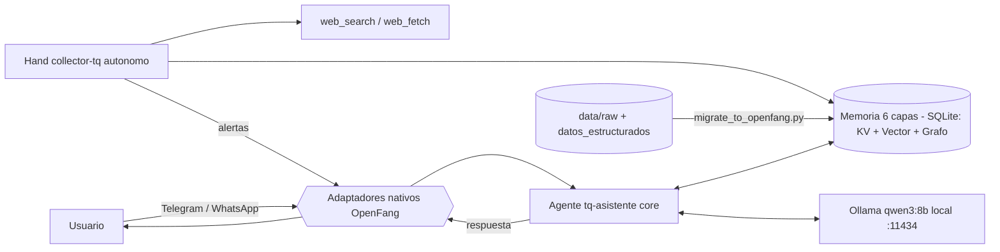

# Informe Técnico Final — TQ-Asistente
## Módulo 3: Productización con un Agent OS (Ruta B — OpenFang)

> Documento fuente del informe en PDF. Exportar con:
> `pandoc docs/informe-final.md -o informe-final.pdf` (o imprimir desde el visor de Markdown).
> Completar antes de entregar: `OpenFang vX.Y.Z` (salida de `openfang --version`), capturas del dashboard y gráficos t-SNE/UMAP generados (`notebooks/intent_*.png`).

---

## 1. Problema y Solución

**Empresa (Valle del Cauca):** Tecnoquímicas S.A. (TQ Confiable / tqfarma), Cali. Multilatina
farmacéutica y de consumo masivo, 90+ años, 4.000+ referencias de producto.

**Necesidad:** un asistente conversacional confiable que responda, en canales reales de
mensajería, preguntas sobre la empresa, sus marcas y su biblioteca científica, **sin alucinar**
y **manejando con cuidado los temas sensibles** (salud, retiros, litigios) propios de una farmacéutica.

**Solución (M3):** se "productiza" el prototipo migrándolo a **OpenFang**, un Agent OS en Rust.
El conocimiento corporativo se inyecta en la memoria del OS; un agente conversacional atiende a
los usuarios por **Telegram y WhatsApp**; y un **hand autónomo** (`collector-tq`) monitorea la
industria farmacéutica en segundo plano.

---

## 2. Evolución Arquitectónica (Módulo 2 → Módulo 3)

| Dimensión | Módulo 2 (prototipo, Ruta A) | Módulo 3 (producción, Ruta B) |
|---|---|---|
| Runtime | FastAPI + LangGraph (Python) | **OpenFang Agent OS** (binario Rust, ~32 MB) |
| Orquestación | Grafo `classify → direct/structured/rag → generate` | Agente `builtin:chat` + tools + **Hand autónomo** |
| Vector store | Chroma (local) | Memoria **6 capas** de OpenFang (SQLite: KV · vector · grafo · sesiones · tareas · canónicas) |
| Memoria de hilo | Checkpointer SQLite (LangGraph) | Sesiones canónicas **cross-channel** del OS |
| LLM | Ollama qwen3:8b | Ollama qwen3:8b (igual — soberanía de datos) |
| Interfaz | Next.js (assistant-ui), HTTP/SSE propio | **Telegram + WhatsApp** (puentes nativos del OS) |
| Datos exactos | tool `get_structured_data` (JSON) | **Structured KV Store** del OS (mismo JSON) |
| Autonomía | Reactivo (request/response) | **Proactivo**: el Collector corre en agenda 24/7 |
| Seguridad | La del proceso Python | 16 sistemas (sandbox WASM, audit Merkle, SSRF, zeroización de secretos…) |

El stack del Módulo 2 **se conserva** como entregable y como **fuente del conocimiento**:
`data/raw/*.json` (1.442 documentos limpios de tqconfiable.com + tqfarma.com) y
`apps/api/datos_estructurados.json` (datos verificados) son el puente hacia OpenFang.

---

## 3. Ruta B en detalle

### 3.1 Ventajas del Agent OS
- **Seguridad en WASM:** el código de tools corre en un sandbox WebAssembly con doble medición
  (fuel + epoch), límites de memoria y timeouts; subprocesos aislados con `env_clear()`.
- **Gestión de RAM / footprint:** un binario único (~32 MB), ~40 MB de RAM en reposo, arranque
  en frío < 200 ms — frente a los cientos de MB de los frameworks Python.
- **Memoria de 6 capas** unificada en un solo SQLite, con sesiones canónicas que comparten
  contexto entre Telegram y WhatsApp.
- **Hands**: capacidades autónomas versionadas (manifiesto + playbook + SKILL.md), no chatbots reactivos.

### 3.2 Inyección de la memoria corporativa
`scripts/migrate_to_openfang.py` (clase `OpenFangMemoryClient`) inyecta el contexto en dos capas:
1. **Structured KV Store** vía REST (`PUT /api/memory/agents/{id}/kv/{key}`): identidad, contacto,
   sedes, marcas, líneas de negocio, sostenibilidad, empleo — datos exactos y verificados.
2. **Vector / semantic store**: inserción idempotente del corpus (`data/raw/*.json`) en la tabla
   `memories` del SQLite de OpenFang. OpenFang no expone REST de ingesta masiva; su recall por
   defecto hace match de texto sobre `content`, por lo que se inyecta contenido + metadata
   (URL, título, fuente, content_hash) sin imponer un espacio vectorial ajeno.

Además, `hands/collector-tq/SKILL.md` actúa como **identidad base permanente** (historia, marcas,
canales oficiales, protocolo de temas sensibles).

### 3.3 El HAND.toml elegido: `collector-tq` (Perfil Analítico — Opción B)
Hand de **inteligencia competitiva** adaptado a TQ. Estructura: manifiesto (tools OSINT: `web_search`,
`web_fetch`, `knowledge_*`, `schedule_*`, `memory_*`), settings con defaults TQ (objetivo = TQ + industria
farma Colombia; enfoque = competidores; frecuencia = diaria; sentimiento de marca = on), un **playbook de
7 fases** en español (recuperación de estado → agenda → construcción de consultas → barrido → grafo de
conocimiento → detección de cambios/sentimiento → reporte → persistencia) y métricas de dashboard.
Incorpora **guardrails farmacéuticos**: nunca fabricar inteligencia, y tratar retiros/alertas/litigios/
farmacovigilancia como "señales a verificar" redirigiendo a canales oficiales e INVIMA.

### 3.4 Persona y protocolo (portados del Módulo 2)
El agente `tq-asistente` conserva el protocolo de respuesta **TOTAL / PARCIAL / NULA / SENSIBLE**:
los temas sensibles (salud, retiros, litigios) se redirigen a los canales oficiales sin confirmar ni
negar hechos; las respuestas son en español neutro y breves; los resúmenes públicos de la biblioteca
científica de tqfarma invitan cálidamente a leer el artículo completo en el portal.

---

## 4. Diagrama End-to-End



Flujo: **Usuario → Canal (adaptador) → Agente (core) → LLM local (Ollama) → Memoria → Retorno**.
El Collector opera en paralelo, alimentándose de la web y publicando alertas al mismo canal.

---

## 5. Análisis de intenciones — t-SNE / UMAP (Bonus)

Notebook: `notebooks/intent_tsne.ipynb` (`make tsne`). Extrae los turnos de usuario del historial de
sesiones de OpenFang (REST → espejo JSONL → semilla sintética), los vectoriza con
`qwen3-embedding:0.6b` (fallback TF-IDF), clusteriza con KMeans y proyecta en 2D con **t-SNE** y **UMAP**.

**Clústeres de intención esperados:** datos de contacto · producto/farmacéutica · historia/corporativo ·
empleo · biblioteca científica de tqfarma · temas sensibles · interacción social.

**Lectura operativa:** un clúster sensible grande pide reforzar el protocolo SENSIBLE; un clúster de
producto denso sugiere ampliar ese contenido en la memoria; los outliers son intenciones nuevas a cubrir.

> _Insertar aquí `intent_tsne.png` e `intent_umap.png` y las conclusiones sobre los clústeres reales._

---

## 6. Reproducibilidad

Código en GitHub. Arranque resumido (detalle en `openfang/README.md`):

```bash
curl -fsSL https://openfang.sh/install | sh    # binario, sin Rust
openfang init && make of-config && make of-start
make of-migrate    # KV + corpus → memoria de OpenFang
make of-hand       # activa collector-tq
make of-whatsapp   # gateway QR de WhatsApp (3009); Telegram se activa con el token del .env
make tsne          # bonus
```

**Versión de OpenFang usada:** `0.6.9` (pre-1.0).

### Verificación end-to-end (realizada)
- Daemon arranca sobre `ollama/qwen3:8b` (205 modelos disponibles, API en `:4200`).
- Migración: **7 claves** en el KV store + **1.894 chunks** del corpus + **6 frases de hechos** en el vector store (tabla `memories`), idempotente.
- Agente `tq-asistente`: pregunta de contacto → responde en español con el teléfono, línea ética y horario correctos (vía `memory_recall`). Pregunta **sensible** (retiro/demanda del MK) → **no confirma ni niega**, redirige a canales oficiales. ✔
- Hand `collector-tq`: se instala desde disco, se activa (`openfang hand activate collector-tq`) y arranca el agente autónomo `collector-tq-hand`. ✔

### Notas de implementación aprendidas en runtime
- El `[memory].sqlite_path` con `~` literal NO se expande (rompe el arranque); se omite y OpenFang usa su default.
- Actualizar el manifiesto de un agente requiere DELETE + POST (no hay update en caliente); por eso el agente conserva su id re-etiquetando sus memorias.
- El modelo local 8B requiere un system prompt directivo (forzar español + `memory_recall` como primera acción) para no alucinar ni cambiar de idioma (riesgo R1).
